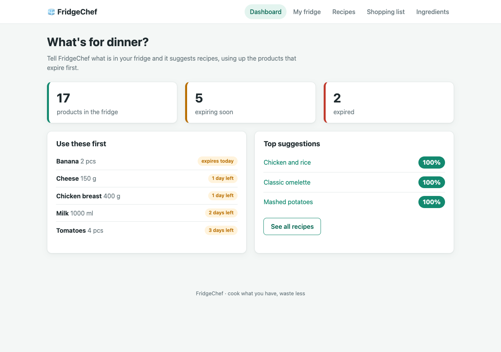
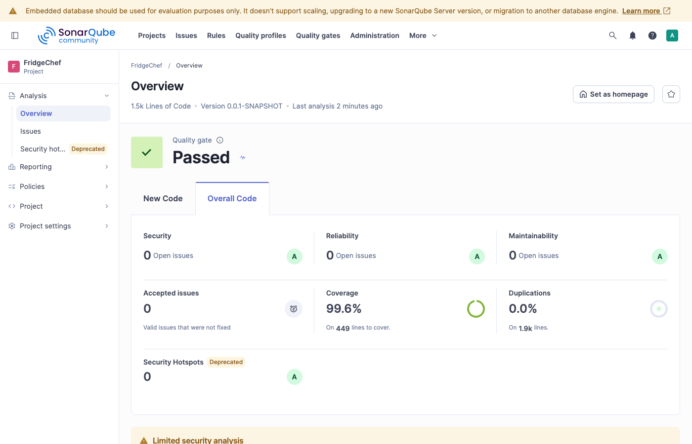
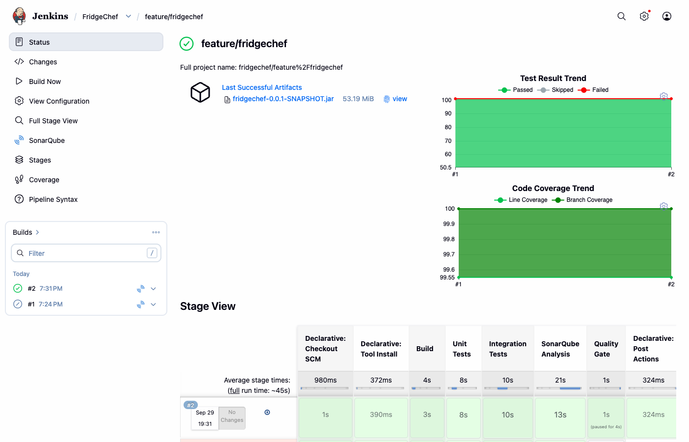

# FridgeChef

**Cook what you have, waste less.** FridgeChef is a Spring Boot web application that keeps track of the food in
your fridge, suggests recipes you can cook right now, and uses up the products that are about to expire first.



## The idea

Around a third of food ends up in the bin, mostly because we forget what is in the fridge until it goes off.
FridgeChef flips the usual question "what do I want to cook?" into "what can I cook from what I already have?":

1. **Track the fridge.** Every product has a quantity and a best-before date. If you don't enter a date, it is
   calculated from the ingredient's shelf life. Products are marked *fresh*, *expiring soon* (3 days or fewer by
   default) or *expired*.
2. **Match recipes.** Each recipe gets a match percentage based on the fresh stock in the fridge. Expired products
   are never counted. When two recipes match equally, the one that uses more products expiring soon comes first.
3. **Cook.** Cooking deducts the ingredients using **FEFO** (first expired, first out), so the oldest batch is used
   first. You can't cook a recipe unless everything is in stock.
4. **Shop for what is missing.** One click adds a recipe's missing ingredients to the shopping list. Quantities are
   merged with items already on the list. Items you've bought go straight into the fridge.

## Features

| Page | What it does |
|------|--------------|
| Dashboard `/` | Fridge summary (total, expiring soon, expired), products to use first, top 3 recipe matches |
| My fridge `/fridge` | Add products (the expiry date is optional), remove them, throw away everything expired |
| Recipes `/recipes` | All recipes ranked by match, with a minimum-match filter (0 / 25 / 50 / 75 / 100%) |
| Recipe details `/recipes/{id}` | Needed vs. available per ingredient, *Cook it*, *Add missing to shopping list* |
| Shopping list `/shopping-list` | Add items, tick them off, move purchased items to the fridge |
| Ingredients `/ingredients` | Ingredient catalogue: unit (g / ml / pcs) and shelf life |

On startup the app loads demo data: 21 ingredients, 12 recipes and 17 fridge products. Expiry dates are relative to
today, so there are always fresh, expiring and expired products to show.

## Tech stack

- Java 21, Spring Boot 4.1 (Web MVC, Data JPA, Validation), Thymeleaf, H2 in-memory database
- Maven (wrapper included, no local Maven install needed)
- JUnit 5, Mockito, AssertJ, Spring MockMvc, `@DataJpaTest`, `@SpringBootTest`
- JaCoCo for coverage, SonarQube for quality, Jenkins for CI

## Architecture

```
web (controllers, Thymeleaf views)  ->  service  ->  repository (Spring Data JPA)  ->  H2
        |                                  |
       dto  <------------  mapper  <---  domain (JPA entities)
```

| Package | Contents |
|---------|----------|
| `domain` | JPA entities: `Ingredient`, `FridgeItem`, `Recipe`, `RecipeIngredient`, `ShoppingListItem` |
| `repository` | Spring Data repositories, with `@EntityGraph` to avoid N+1 queries |
| `service` | Business logic: `FridgeService`, `RecipeMatchingService`, `CookingService`, `ShoppingListService`, `IngredientService`, `FreshnessPolicy` |
| `dto` | Form objects with Bean Validation, and immutable view records such as `RecipeMatch` and `FridgeItemView` |
| `mapper` | Entity to DTO mapping |
| `web` | Controllers using the Post/Redirect/Get pattern with flash messages, plus a global 404 handler |
| `exception` | Domain exceptions: `ResourceNotFoundException`, `DuplicateIngredientException`, `InsufficientIngredientsException` |
| `config` | Typed `fridgechef.*` properties and a `Clock` bean, so tests can fix "today" |

Views never see entities: controllers get DTOs from services only.

## Running the application

Requirements: JDK 21.

```bash
./mvnw spring-boot:run
# or
./mvnw package -DskipTests && java -jar target/fridgechef-0.0.1-SNAPSHOT.jar
```

Open http://localhost:8080. The H2 console is at http://localhost:8080/h2-console
(JDBC URL `jdbc:h2:mem:fridgechef`, user `sa`, empty password).

Configuration in `src/main/resources/application.yml`:

| Property | Default | Meaning |
|----------|---------|---------|
| `fridgechef.expiring-soon-days` | `3` | A product with this many days left or fewer is *expiring soon* |
| `server.port` | `8080` | HTTP port |

## Tests and coverage

| Type | Naming | Run by | What |
|------|--------|--------|------|
| Unit | `*Test.java` | Surefire (`test` phase) | Services with Mockito mocks, DTOs, mappers, domain, and controller slices via `@WebMvcTest` |
| Integration | `*IT.java` | Failsafe (`verify` phase) | Repositories via `@DataJpaTest`; end-to-end flows via `@SpringBootTest` + MockMvc on a real H2 database; demo data loading |

```bash
./mvnw test                          # unit tests only (85)
./mvnw verify                        # unit + integration tests (101), JaCoCo report and coverage check
./mvnw verify -DskipUnitTests=true   # integration tests only (16)
```

The JaCoCo report is written to `target/site/jacoco/index.html`. The build **fails** if line coverage drops below
80%, both for the whole project and for the `com.fridgechef.service` package.

Current result: **99.6% line coverage, 100% branch coverage, 100% on services.**

## Code quality: SonarQube



Quality Gate **Passed**: 0 bugs, 0 vulnerabilities, 0 code smells, 0 security hotspots, 0% duplication, and an
**A** rating for security, reliability and maintainability.

To run an analysis against a SonarQube server on `localhost:9000`:

```bash
./mvnw verify sonar:sonar -Dsonar.token=<your token>
```

The `sonar.*` properties (project key, JaCoCo XML path, test report paths) are already in `pom.xml`.

<details>
<summary>Setting up a local SonarQube</summary>

1. Download SonarQube Community Build from https://www.sonarsource.com/products/sonarqube/downloads/ and unzip it.
2. Allow webhooks to `localhost` (needed for the Jenkins quality gate) by adding this line to `conf/sonar.properties`:
   ```properties
   sonar.validateWebhooks=false
   ```
3. Start it: `bin/macosx-universal-64/sonar.sh start` (use the `linux-*` or `windows-*` folder on other systems).
   Log in at http://localhost:9000 as `admin` / `admin` and change the password.
4. Create a token under *My Account → Security* and save it to `~/.fridgechef-ci/sonar-token`.
5. Add a webhook to Jenkins:
   ```bash
   curl -u admin:<password> -X POST http://localhost:9000/api/webhooks/create \
        --data-urlencode name=Jenkins --data-urlencode url=http://localhost:8090/sonarqube-webhook/
   ```
</details>

## Continuous integration: Jenkins

The pipeline is defined in the [`Jenkinsfile`](Jenkinsfile):

| Stage | Command | Published |
|-------|---------|-----------|
| Build | `./mvnw clean compile` | |
| Unit Tests | `./mvnw test` | JUnit results |
| Integration Tests | `./mvnw verify -DskipUnitTests=true` | JUnit results, JaCoCo coverage (unit + IT) |
| SonarQube Analysis | `./mvnw sonar:sonar` inside `withSonarQubeEnv` | Link to the SonarQube dashboard |
| Quality Gate | `waitForQualityGate abortPipeline: true` | The build fails if the gate fails |

After a successful build, the application jar is archived as a build artifact.



### Local Jenkins, fully configured as code

Everything Jenkins needs lives in [`ci/jenkins`](ci/jenkins), so there is no setup wizard and no clicking around:

- `plugins.txt`: plugins, installed with `jenkins-plugin-manager`
- `casc.yaml`: [Configuration as Code](https://www.jenkins.io/projects/jcasc/) for the admin user, the `jdk21` tool,
  the SonarQube server and token credential, and a **multibranch pipeline job `fridgechef`** (created with Job DSL).
  The job builds every branch that has a `Jenkinsfile` and rescans the repository every 5 minutes.
- `start-jenkins.sh` / `stop-jenkins.sh`: download Jenkins LTS and the plugins on the first run, then start or
  stop Jenkins on http://localhost:8090

```bash
ci/jenkins/start-jenkins.sh
ci/jenkins/stop-jenkins.sh
```

Secrets are never stored in the repository. They are read from `~/.fridgechef-ci/`:

| File | Content |
|------|---------|
| `sonar-token` | SonarQube analysis token (create it yourself, see above) |
| `jenkins-admin-password` | Password for the Jenkins user `admin`, generated on the first start |

By default the job builds this local clone. To build from GitHub instead, start Jenkins with
`FRIDGECHEF_REPO_URL=https://github.com/<user>/<repo>.git ci/jenkins/start-jenkins.sh`.

## Demo scenarios

**1. Recipe matching and cooking with FEFO**

1. Open *Dashboard*. The fridge summary shows expiring and expired products, and the top recipe matches.
2. Open *Recipes*. Recipes are ranked by match %; set the filter to 100% to see only what you can cook now.
3. Open *Classic omelette* (100% match). Milk is tagged *use soon* because it expires in 2 days.
4. Click **Cook it**. The ingredients are deducted from the fridge, oldest batch first. Eggs go from 6 to 3.
5. A recipe with missing ingredients has **Cook it** disabled, and the missing amounts are highlighted.

**2. From missing ingredients to the fridge**

1. Open *Yogurt parfait* (25% match): the yogurt in the fridge has expired, and oats and honey are missing.
2. Click **Add missing to shopping list**. Yogurt 200 g and oats 50 g are added, and honey is merged into the
   existing honey item.
3. On *Shopping list*, tick the items as bought and click **Put bought items in the fridge**.
4. Back on *Yogurt parfait*: **100% match**. Cook it.

## Project history

The work is split into small commits on the `feature/fridgechef` branch: project setup, then domain, DTOs, services,
UI, demo data, tests, Sonar fixes and CI. See `git log --oneline`.
